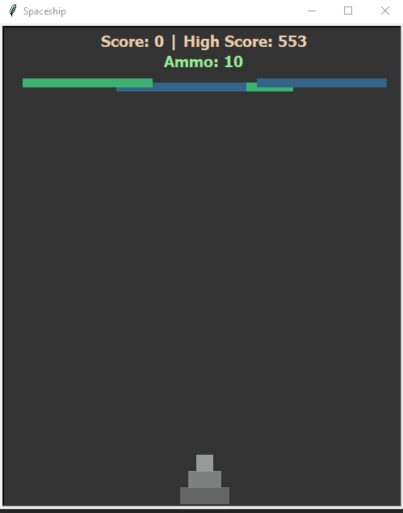

# Spaceship
An mordern version of the old 90s Spaceship Game

### Written in python 3.9 

## Installation on Windows:
* `git clone https://github.com/snehangsude/Spaceship.git`
* `cd Spaceship`
* `python main.py`

## Installation on Linux and Unix like OS:
* `git clone https://github.com/snehangsude/Spaceship.git`
* `cd Spaceship`
* `python3 main.py`

## Interface GIF
* Inital screen

## How to play

* Run the application using the Installation section
* Key Bindings:
  * <b>UP</b> Arrow - Move up
  * <b>DOWN</b> Arrow - Move down
  * <b>LEFT</b> Arrow - Move left
  * <b>RIGHT</b> Arrow - Move right
  * <b>SPACE</b> Arrow - Plant Repel Bomb
  * <b>ESC</b> Arrow - Exit the game
* Enjoy!

## Rules (Know what to expect from the game)

* Try to save the head (1st compartment) & you are good - ignore the body
* The score increases only when any blockade is below the 3rd compartment
* Hitting on <b>SPACE</b> would plant the Repel Bomb directly below the 2nd compartment
* The Repel Bomb works only when near the spaceship
* There are only 10 Repel Bombs so use them scarcely and carefully
* Colliding with the blockade will return you to the base position and your score would be reset to zero (0)
* The Spaceship is limited to move only little less than halfway above

### Improvements planned

* Plans to improve the compartment sensitivity to blockades
* Plans to setup a random ammunition drop for re-fill of ammunition
